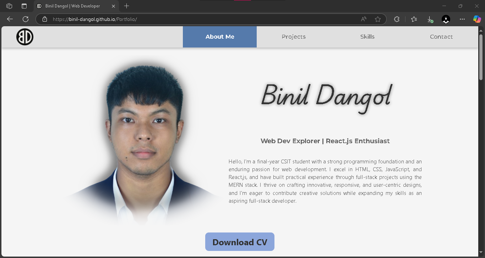

# Portfolio

A personal portfolio website showcasing my skills, projects, and contact information. Built with React.js and deployed via GitHub Pages.  

➡️ Live demo: [https://binil-dangol.github.io/Portfolio/](https://binil-dangol.github.io/Portfolio/)

---

## Table of Contents

- [Features](#features)  
- [Demo](#demo)  
- [Getting Started](#getting-started)  
- [Available Scripts](#available-scripts)  
- [Project Structure](#project-structure)  
- [Deployment](#deployment)  
- [Technologies Used](#technologies-used)  
- [License](#license)  

---

## Features

- 💻 **About Me** section with background, skills, and resume download  
- 🛠️ **Projects** gallery showcasing live demos and source links  
- 📱 **Responsive design** for desktop, tablet, and mobile  
- ✉️ **Contact form** that sends messages via email or API  
- ⚡ **Fast development** with Vite’s hot module replacement  

---

## Demo

  
*Figure: Screenshot of the portfolio site.*  

Check it out live: [https://binil-dangol.github.io/Portfolio/](https://binil-dangol.github.io/Portfolio/)

---

## Getting Started

1. **Prerequisites:**  
   - Node.js v14+  
   - npm v6+ (or Yarn)

2. **Clone, install dependencies & start the dev server:**
   ```bash
   git clone https://github.com/binil-dangol/Portfolio.git
   cd Portfolio
   npm install
   npm run dev
   ```

3. **Open your browser at http://localhost:5173 (or the URL shown in the console).**

---

## Available Scripts
In the project directory, you can run:

| Command           | Description                                        |
| ----------------- | -------------------------------------------------- |
| `npm run dev`     | Start Vite development server (hot-reload enabled) |
| `npm run build`   | Create a production build in the `dist/` folder    |
| `npm run preview` | Preview the production build locally               |
| `npm run deploy`  | Build & deploy to GitHub Pages (`gh-pages` branch) |

---

## Project Structure

```text
Portfolio/
├── public/
│   ├── favicon.ico
│   └── index.html
├── src/
│   ├── assets/
│   │   └── screenshots/
│   │       └── Portfolio_SS.png
│   ├── components/
│   │   ├── Navbar.jsx
│   │   ├── Hero.jsx
│   │   ├── Projects.jsx
│   │   ├── About.jsx
│   │   ├── Contact.jsx
│   │   └── Footer.jsx
│   ├── App.jsx
│   ├── main.jsx
│   └── index.css
├── .gitignore
├── package.json
├── vite.config.js
└── README.md
```

---

## Deployment
This project is configured to deploy to GitHub Pages. Make sure the homepage field in package.json is set to:
```text
"homepage": "https://binil-dangol.github.io/Portfolio/"
```
To build and publish:
```text
npm run deploy
```

---

## Technologies Used
- **React.js**
- **Vite**
- **Github Pages**
- **CSS**

---

## License
This project is open source and available under the MIT License.
